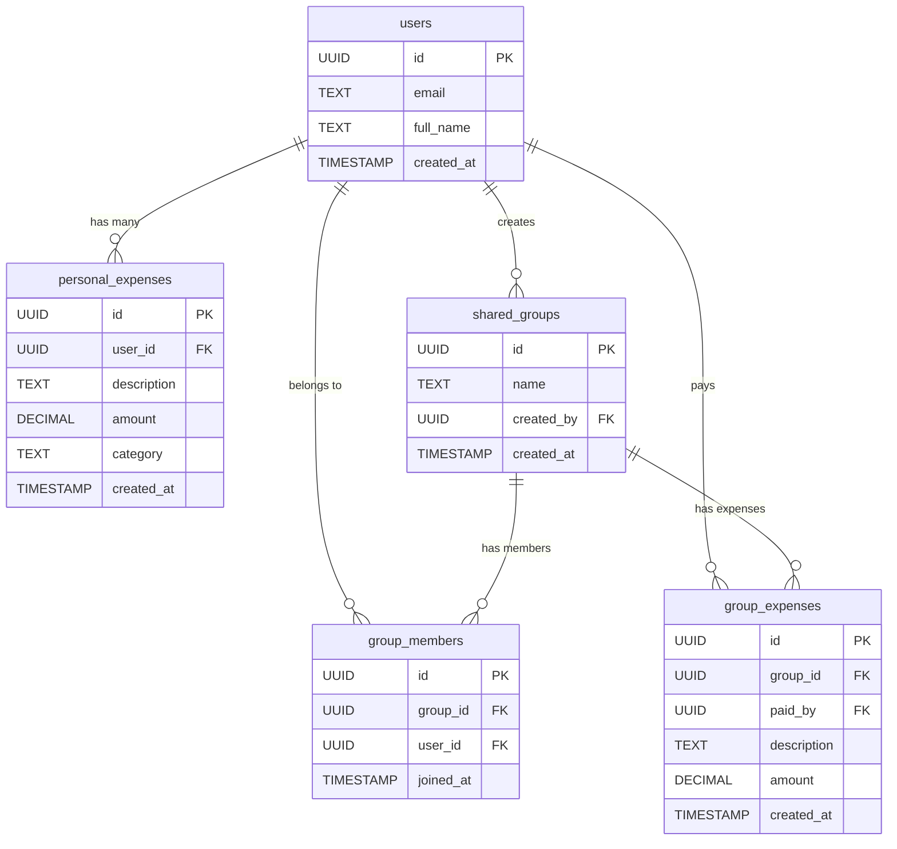

# Bill Splitter App — Product Requirements Document (PRD)

**Version:** 1.0  
**Date:** June 23, 2026  
**Status:** Draft — Awaiting Review  

---

## Table of Contents

1. [Executive Summary](#section-1-executive-summary)
2. [User Personas](#section-2-user-personas)
3. [Core Features](#section-3-core-features)
4. [User Flows](#section-4-user-flows)
5. [Pages and Components](#section-5-pages-and-components)
6. [Database Schema](#section-6-database-schema)
7. [Authentication & Security](#section-7-authentication--security)
8. [Non-Functional Requirements](#section-8-non-functional-requirements)

---

## SECTION 1: EXECUTIVE SUMMARY

### What is the app?

Bill Splitter is a web application that helps people track their personal spending and split shared expenses with friends, flatmates, or travel buddies. Users can log their own day-to-day expenses, create groups for shared spending (like a weekend trip or monthly rent), add friends to those groups, and instantly see who owes whom — all in one clean dashboard.

### What problem does it solve?

Splitting bills among friends is messy. People forget who paid for dinner, argue over how much they owe, and lose track of shared costs over weeks or months. Spreadsheets get confusing. Chat messages get buried. Bill Splitter removes the guesswork by giving everyone a single place to log expenses, see balances, and settle up fairly — with the fewest number of payments possible.

### What technology stack is used?

| Layer | Technology |
|---|---|
| Frontend Framework | **React** (component-based UI) |
| Full-Stack Framework | **Next.js** (routing, server-side rendering, API routes) |
| Database & Auth | **Supabase** (PostgreSQL database, built-in authentication, row-level security) |
| Styling | **Tailwind CSS** (utility-first CSS framework for responsive design) |
| Hosting | **Vercel** (automatic deployment from Git) |

### Is every feature real or simulated?

Every feature described in this document is **real and fully functional** — not mocked, not hard-coded, and not simulated. Data is stored in a real database. Authentication uses real email and password flows. Calculations happen with real numbers from real records. What the user sees is what actually exists in the system.

---

## SECTION 2: USER PERSONAS

### Persona 1: Aarav Mehta

| Detail | Description |
|---|---|
| **Age** | 24 |
| **Location** | Bangalore, India |
| **Occupation** | Software developer, living with two flatmates |

**What's his life like?**

Aarav shares a 3BHK apartment with two college friends. They split rent, electricity, Wi-Fi, groceries, and weekend food orders between the three of them. Every month, someone pays the full electricity bill, someone else handles groceries, and the third person covers Wi-Fi. By the end of the month, nobody remembers exactly who paid what, and the mental math becomes a source of small but regular arguments.

**What's his problem?**

Aarav currently uses a shared Google Sheet to track expenses, but his flatmates forget to update it. He ends up doing all the bookkeeping himself. When it's time to settle, they disagree on the numbers because nobody trusts the sheet. He wants a system where everyone logs their own payments, and the app figures out the rest — no arguing, no spreadsheets, no forgotten entries.

**What's his goal with the app?**

Aarav wants to create a group called "Flat Expenses," add his two flatmates, and have all three of them log what they pay for. At the end of every month, he wants to open the app and see one clear screen that says "Rohan owes Aarav ₹1,200" or "Aarav owes Priya ₹800" — settled in the fewest payments possible. He also wants to track his personal spending (coffee, subscriptions, online orders) separately, so he can see where his money goes each month.

---

### Persona 2: Sneha Kulkarni

| Detail | Description |
|---|---|
| **Age** | 28 |
| **Location** | Pune, India |
| **Occupation** | Marketing manager who organises group trips with friends |

**What's her life like?**

Sneha is the "planner" in her friend circle. She organises weekend getaways, birthday dinners, and festival trips two or three times a year. During these trips, different people pay for different things — one person books the hotel, another pays for fuel, someone covers meals. By the end of the trip, there are fifteen different payments across eight people, and figuring out who owes who becomes a nightmare.

**What's her problem?**

After every trip, Sneha spends hours collecting screenshots of bills, writing down who paid what, and manually calculating the split. Friends send her partial updates on WhatsApp. Some people claim they paid for things they didn't. Others forget what they owe. The process takes days, and someone always feels short-changed. She needs a system that everyone updates in real-time, where the math is automatic and transparent.

**What's her goal with the app?**

Before a trip, Sneha wants to create a group (e.g., "Goa Trip June 2026"), invite all eight friends by email, and have everyone add their expenses as they spend during the trip. At the end, she wants to open one screen that shows the minimum number of payments needed to settle all debts — for example, "Person A pays Person B ₹3,400" and "Person C pays Person D ₹1,100." No spreadsheets, no arguments, no missing entries.

---

## SECTION 3: CORE FEATURES

### 3.1 User Sign Up and Login

Users create an account using their **email address**, **password**, and **full name**. After signing up, they can log in anytime with just their email and password. The system remembers them — if they close the browser and come back, they stay logged in until they choose to log out. There is no social login (Google, Facebook). Email and password only.

### 3.2 Add Personal Expenses

Once logged in, a user can add a personal expense by filling out a simple form with three pieces of information:

- **Amount** — How much money was spent (must be a positive number).
- **Description** — What the money was spent on (e.g., "Coffee at Starbucks," "Monthly gym fee").
- **Category** — A label that groups the expense (e.g., Food, Travel, Shopping, Bills, Entertainment, Health, Other).

The expense is saved immediately and shows up in the user's personal expense list, sorted with the newest first.

### 3.3 See Your Spending Stats

At the top of the expenses page, the user sees four summary cards that update in real time:

| Card | What it shows |
|---|---|
| **Total Spent** | The total amount of all personal expenses, ever |
| **This Month** | The total amount spent in the current calendar month |
| **Expense Count** | How many individual expenses the user has recorded |
| **Average Expense** | The total amount divided by the number of expenses |

These numbers update instantly when a new expense is added or an old one is deleted.

### 3.4 Create Groups

A user can create a new group by giving it a **name** (e.g., "Goa Trip," "Flat Mates," "Office Lunch Club"). The person who creates the group is automatically added as the first member. Groups are shown as cards on the groups page, displaying the group name, number of members, and the date it was created.

### 3.5 Add Friends to Groups

The group creator (or any member of the group) can add other users to the group by entering their **email address**. The app checks if that email belongs to a registered user. If yes, that person is added to the group and can now see the group, its expenses, and the balances. If no user with that email exists, the app shows an error message saying the person needs to sign up first.

### 3.6 Add Group Expenses

Any member of a group can add an expense to that group. A group expense records:

- **Who paid** — The person adding the expense is recorded as the one who paid.
- **How much** — The amount paid (must be a positive number).
- **Description** — What the payment was for (e.g., "Hotel booking," "Dinner at beach shack").

The expense is split **equally** among all current members of the group. For example, if a group has 4 members and one person pays ₹2,000, each member's share is ₹500. The person who paid is considered to have covered everyone else's share, so the other 3 members each owe ₹500 to the payer.

### 3.7 See Who Owes Whom in the Group

Inside each group, there is a **Balances** section that shows the settlement summary — a list of simple statements like:

- "Rohan owes Aarav ₹1,200"
- "Priya owes Sneha ₹800"

This list is calculated using a **minimum transactions algorithm** (described in Section 8) that reduces the number of payments needed to settle all debts. Instead of everyone paying everyone else back and forth, the app figures out the smallest number of direct payments that clear all balances.

### 3.8 Delete Things You Created

- A user can **delete their own personal expenses** — one at a time, using a delete button next to each expense.
- A user can **delete a group** they created — this removes the group, all its members, and all its expenses permanently.
- A user can **delete a group expense** they added.
- Users **cannot** delete other people's expenses or groups they didn't create.

When something is deleted, a confirmation step is shown before the action is carried out. After deletion, the stats and balances update automatically.

### 3.9 See Only Your Own Data (Privacy)

Every user sees only their own information:

- **Personal expenses:** A user can only see expenses they created. They cannot see anyone else's personal spending.
- **Groups:** A user can only see groups they are a member of. They cannot browse or search for other groups.
- **Group expenses:** Within a group, all members can see all expenses for that group — but they cannot see expenses from groups they don't belong to.

These rules are enforced at the **database level**, not just in the website code. Even if someone tries to access data through the browser's developer tools or the API directly, the database will block them.

### 3.10 Stay Logged In When You Refresh

When a user logs in, their session is saved in the browser. If they close the tab and come back, or refresh the page, they remain logged in. They don't have to type their email and password again. The session lasts until the user clicks "Log out" or the session expires naturally (after a long period of inactivity, as set by Supabase defaults).

### 3.11 A Working Sidebar That Doesn't Reload

The dashboard has a **sidebar** on the left side that contains navigation links:

- **Expenses** — Go to the personal expenses page
- **Groups** — Go to the groups page
- The user's **email address** displayed at the bottom
- A **Log out** button

Clicking a link in the sidebar loads the new page **without refreshing the entire browser window**. The sidebar stays in place. The page content area on the right changes. This is standard single-page application behavior powered by Next.js client-side routing.

---

## SECTION 4: USER FLOWS

### Flow 1: How Someone Signs Up

1. The user opens the app and lands on the **Login** page.
2. They see a link at the bottom that says **"Don't have an account? Sign up"** and click it.
3. They are taken to the **Sign Up** page.
4. They fill in three fields:
   - **Full Name** (e.g., "Aarav Mehta")
   - **Email** (e.g., "aarav@email.com")
   - **Password** (must be at least 6 characters)
   - **Confirm Password** (must match the password above)
5. They click the **"Create Account"** button.
6. **If everything is valid:**
   - The account is created in the database.
   - The user is automatically logged in.
   - They are taken to the **Dashboard → Expenses** page.
   - A success message appears: **"Account created successfully!"**
7. **If something is wrong:**
   - Missing fields → **"Please fill in all fields."**
   - Passwords don't match → **"Passwords do not match."**
   - Email already used → **"An account with this email already exists."**
   - Password too short → **"Password must be at least 6 characters."**

### Flow 2: How Someone Logs In

1. The user opens the app and is on the **Login** page.
2. They enter their **email** and **password**.
3. They click the **"Sign In"** button.
4. **If credentials are correct:**
   - They are taken to the **Dashboard → Expenses** page.
   - The sidebar shows their email and navigation links.
5. **If credentials are wrong:**
   - The page shows: **"Invalid email or password. Please try again."**
   - The user stays on the login page and can try again.

### Flow 3: How Someone Adds a Personal Expense

1. The user is on the **Dashboard → Expenses** page.
2. They see a form at the top with three fields:
   - **Description** (text input, e.g., "Lunch at office canteen")
   - **Amount** (number input, e.g., "150")
   - **Category** (dropdown menu with options: Food, Travel, Shopping, Bills, Entertainment, Health, Other)
3. They fill in the fields and click **"Add Expense."**
4. **If everything is valid:**
   - The expense appears at the top of the list below the form.
   - The four stats cards update instantly.
   - A success message appears: **"Expense added successfully!"**
5. **If something is wrong:**
   - Missing description → **"Please enter a description."**
   - Amount is zero or negative → **"Amount must be greater than zero."**
   - No category selected → **"Please select a category."**

### Flow 4: How Someone Creates a Group and Adds a Friend

1. The user is on the **Dashboard → Groups** page.
2. They see a form with one field:
   - **Group Name** (text input, e.g., "Goa Trip June 2026")
3. They type the name and click **"Create Group."**
4. **If the name is valid:**
   - The group appears in the list below.
   - The user is automatically added as the first member.
   - A success message appears: **"Group created successfully!"**
5. **If the name is empty:**
   - An error shows: **"Please enter a group name."**
6. The user clicks on the group card to open the **Group Detail** page.
7. Inside the group page, they see an **"Add Member"** section with an email input.
8. They type a friend's email (e.g., "sneha@email.com") and click **"Add Member."**
9. **If the email belongs to a registered user:**
   - That person is added to the group.
   - The member list updates to show the new member.
   - A success message appears: **"Member added successfully!"**
10. **If the email is not found:**
    - An error shows: **"No user found with this email. They need to sign up first."**
11. **If the person is already in the group:**
    - An error shows: **"This user is already a member of this group."**

### Flow 5: How Group Expenses Are Visible to All Members

1. **Aarav** creates a group called "Flat Mates" and adds **Rohan** and **Priya** as members.
2. Aarav opens the group and adds an expense: "Electricity bill — ₹3,000."
3. When **Rohan** logs in and opens the "Flat Mates" group, he sees the same expense: "Electricity bill — ₹3,000 — paid by Aarav."
4. When **Priya** logs in, she sees the exact same list.
5. All three members see the same expenses, the same totals, and the same balance summary.
6. The balances section shows each member what they owe or are owed — from their own point of view.

### Flow 6: How Any Member Can Add or Modify Expenses

1. Any member of the group can add a new expense — not just the person who created the group.
2. **Rohan** opens the "Flat Mates" group and adds: "Groceries — ₹1,500."
3. The expense is saved with Rohan listed as the payer.
4. All members (Aarav, Rohan, Priya) can see this new expense.
5. The balances update automatically to account for Rohan's payment.
6. **Rohan** can delete the expense he added (he sees a delete button next to it).
7. **Aarav** and **Priya** cannot delete Rohan's expense — they do not see a delete button on it.
8. **Priya** can also add her own expenses the same way, and only she can delete hers.

### Flow 7: What Happens If They Do Something Wrong (Error Messages)

The app shows clear, plain-English error messages in a visible coloured banner (red background, white text) at the top of the relevant section. Here is a summary of all error messages:

| Situation | Error Message |
|---|---|
| Sign up with empty fields | "Please fill in all fields." |
| Passwords don't match | "Passwords do not match." |
| Password under 6 characters | "Password must be at least 6 characters." |
| Email already registered | "An account with this email already exists." |
| Login with wrong credentials | "Invalid email or password. Please try again." |
| Expense with empty description | "Please enter a description." |
| Expense with zero or negative amount | "Amount must be greater than zero." |
| Expense without a category | "Please select a category." |
| Create group without a name | "Please enter a group name." |
| Add member with unregistered email | "No user found with this email. They need to sign up first." |
| Add member already in the group | "This user is already a member of this group." |
| Network or server error | "Something went wrong. Please try again later." |

### Flow 8: What Shows When It's Working (Success Messages)

The app shows green success messages in a visible banner when an action succeeds:

| Action | Success Message |
|---|---|
| Account created | "Account created successfully! Welcome aboard." |
| Logged in | User is redirected — no message needed (the dashboard is the confirmation). |
| Personal expense added | "Expense added successfully!" |
| Personal expense deleted | "Expense deleted." |
| Group created | "Group created successfully!" |
| Member added to group | "Member added successfully!" |
| Group expense added | "Group expense added successfully!" |
| Group expense deleted | "Expense deleted." |
| Group deleted | "Group deleted successfully." |
| Logged out | User is redirected to the login page. |

---

## SECTION 5: PAGES AND COMPONENTS

### 5.1 Login Page (`/login`)

**What the user sees:**

```
┌──────────────────────────────────────────────┐
│                                              │
│              💰 Bill Splitter                │
│                                              │
│          Sign in to your account             │
│                                              │
│   ┌──────────────────────────────────────┐   │
│   │  Email                               │   │
│   │  aarav@email.com                     │   │
│   └──────────────────────────────────────┘   │
│                                              │
│   ┌──────────────────────────────────────┐   │
│   │  Password                            │   │
│   │  ••••••••                            │   │
│   └──────────────────────────────────────┘   │
│                                              │
│   ┌──────────────────────────────────────┐   │
│   │           SIGN IN                    │   │
│   └──────────────────────────────────────┘   │
│                                              │
│     Don't have an account? Sign up           │
│                                              │
└──────────────────────────────────────────────┘
```

**Components on this page:**

- App name and logo at the top center.
- A subtitle: "Sign in to your account."
- **Email input field** — placeholder text: "Enter your email."
- **Password input field** — placeholder text: "Enter your password." The text is hidden (dots).
- **Sign In button** — full width, primary colour. Shows "Signing in..." while loading.
- **Link to Sign Up** — text at the bottom: "Don't have an account? Sign up" — the words "Sign up" are clickable and go to `/signup`.
- **Error banner** — appears above the form if login fails (red background, white text).

---

### 5.2 Sign Up Page (`/signup`)

**What the user sees:**

```
┌──────────────────────────────────────────────┐
│                                              │
│              💰 Bill Splitter                │
│                                              │
│           Create your account                │
│                                              │
│   ┌──────────────────────────────────────┐   │
│   │  Full Name                           │   │
│   │  Aarav Mehta                         │   │
│   └──────────────────────────────────────┘   │
│                                              │
│   ┌──────────────────────────────────────┐   │
│   │  Email                               │   │
│   │  aarav@email.com                     │   │
│   └──────────────────────────────────────┘   │
│                                              │
│   ┌──────────────────────────────────────┐   │
│   │  Password                            │   │
│   │  ••••••••                            │   │
│   └──────────────────────────────────────┘   │
│                                              │
│   ┌──────────────────────────────────────┐   │
│   │  Confirm Password                    │   │
│   │  ••••••••                            │   │
│   └──────────────────────────────────────┘   │
│                                              │
│   ┌──────────────────────────────────────┐   │
│   │         CREATE ACCOUNT               │   │
│   └──────────────────────────────────────┘   │
│                                              │
│     Already have an account? Sign in         │
│                                              │
└──────────────────────────────────────────────┘
```

**Components on this page:**

- App name and logo at the top center.
- A subtitle: "Create your account."
- **Full Name input field** — placeholder: "Enter your full name."
- **Email input field** — placeholder: "Enter your email."
- **Password input field** — placeholder: "Create a password (min. 6 characters)." Hidden text.
- **Confirm Password input field** — placeholder: "Confirm your password." Hidden text.
- **Create Account button** — full width, primary colour. Shows "Creating account..." while loading.
- **Link to Login** — "Already have an account? Sign in" — "Sign in" links to `/login`.
- **Error banner** — appears above the form if validation fails.
- **Validation rules:**
  - All fields are required.
  - Password must be at least 6 characters.
  - Password and Confirm Password must match.
  - Email must be a valid format.

---

### 5.3 Dashboard Layout (`/dashboard`)

**What the user sees:**

```
┌─────────────────┬───────────────────────────────────────────┐
│                 │                                           │
│  💰 Bill        │                                           │
│     Splitter    │         [ Page Content Area ]             │
│                 │                                           │
│  ───────────    │    This area changes depending on         │
│                 │    which sidebar link is clicked.          │
│  📊 Expenses    │                                           │
│                 │    - /dashboard/expenses                  │
│  👥 Groups      │    - /dashboard/groups                    │
│                 │    - /dashboard/groups/[id]               │
│                 │                                           │
│                 │                                           │
│                 │                                           │
│                 │                                           │
│  ───────────    │                                           │
│  aarav@email    │                                           │
│  [Log out]      │                                           │
│                 │                                           │
└─────────────────┴───────────────────────────────────────────┘
```

**Components on this page:**

- **Sidebar (left side, fixed):**
  - App name/logo at the top.
  - Navigation links: "Expenses" and "Groups."
  - The active link is highlighted (different background colour or bold text).
  - User's email shown near the bottom.
  - "Log out" button at the very bottom — clicking it logs the user out and sends them to `/login`.
- **Content area (right side):**
  - Changes based on the URL.
  - Loads without a full page refresh (client-side navigation).
- **Mobile behaviour:**
  - On screens smaller than 768px, the sidebar collapses into a hamburger menu (☰) at the top.
  - Tapping the hamburger opens the sidebar as an overlay.
  - Tapping a link closes the sidebar and loads the page.

---

### 5.4 Expenses Page (`/dashboard/expenses`)

**What the user sees:**

```
┌───────────────────────────────────────────────────────────────┐
│                                                               │
│   My Expenses                                                 │
│                                                               │
│   ┌──────────┐  ┌──────────┐  ┌──────────┐  ┌──────────┐    │
│   │ Total    │  │ This     │  │ Count    │  │ Average  │    │
│   │ Spent    │  │ Month    │  │          │  │          │    │
│   │ ₹12,450  │  │ ₹3,200   │  │ 24       │  │ ₹518.75  │    │
│   └──────────┘  └──────────┘  └──────────┘  └──────────┘    │
│                                                               │
│   ┌─────────────────────────────────────────────────────┐    │
│   │  Add New Expense                                     │    │
│   │                                                      │    │
│   │  Description: [________________]                     │    │
│   │  Amount:      [________________]                     │    │
│   │  Category:    [▼ Select category ]                   │    │
│   │                                                      │    │
│   │  [ Add Expense ]                                     │    │
│   └─────────────────────────────────────────────────────┘    │
│                                                               │
│   ┌─────────────────────────────────────────────────────┐    │
│   │  Recent Expenses                                     │    │
│   │                                                      │    │
│   │  🍔 Lunch at canteen       ₹150    Food    Today  🗑 │    │
│   │  🚕 Uber to office         ₹280    Travel  Today  🗑 │    │
│   │  🛒 Groceries              ₹1,200  Shopping Jun 20 🗑 │    │
│   │  💡 Electricity bill       ₹900    Bills   Jun 18 🗑 │    │
│   │                                                      │    │
│   └─────────────────────────────────────────────────────┘    │
│                                                               │
└───────────────────────────────────────────────────────────────┘
```

**Components on this page:**

- **Page title:** "My Expenses."
- **Stats cards (4 in a row on desktop, 2x2 on mobile):**
  - Total Spent — sum of all personal expenses.
  - This Month — sum of expenses from the current month.
  - Expense Count — total number of expenses.
  - Average Expense — total ÷ count, rounded to 2 decimal places.
- **Add Expense Form:**
  - Description (text input).
  - Amount (number input, step of 0.01).
  - Category (dropdown: Food, Travel, Shopping, Bills, Entertainment, Health, Other).
  - "Add Expense" button — shows "Adding..." while saving.
- **Expense List:**
  - Each expense is a row showing: category icon, description, amount, category name, date, and a delete button (🗑).
  - Sorted newest first.
  - Delete button is visible only on the user's own expenses (which is all of them here, since personal expenses are private).
  - Clicking delete shows a confirmation: **"Are you sure you want to delete this expense?"** with "Yes, delete" and "Cancel" options.
- **Empty state:** If no expenses exist, the list area shows: "No expenses yet. Add your first one above!"

---

### 5.5 Groups Page (`/dashboard/groups`)

**What the user sees:**

```
┌───────────────────────────────────────────────────────────────┐
│                                                               │
│   My Groups                                                   │
│                                                               │
│   ┌──────────────┐  ┌──────────────┐  ┌──────────────┐      │
│   │ Total Groups │  │ Created      │  │ Joined       │      │
│   │ 4            │  │ 2            │  │ 2            │      │
│   └──────────────┘  └──────────────┘  └──────────────┘      │
│                                                               │
│   ┌─────────────────────────────────────────────────────┐    │
│   │  Create New Group                                    │    │
│   │                                                      │    │
│   │  Group Name: [________________]                      │    │
│   │                                                      │    │
│   │  [ Create Group ]                                    │    │
│   └─────────────────────────────────────────────────────┘    │
│                                                               │
│   ┌─────────────────────────────────────────────────────┐    │
│   │  Your Groups                                         │    │
│   │                                                      │    │
│   │  ┌─────────────────────────────────────────────┐    │    │
│   │  │  🏖 Goa Trip June 2026                       │    │    │
│   │  │  5 members · Created Jun 15 · by you    [🗑] │    │    │
│   │  └─────────────────────────────────────────────┘    │    │
│   │                                                      │    │
│   │  ┌─────────────────────────────────────────────┐    │    │
│   │  │  🏠 Flat Mates                               │    │    │
│   │  │  3 members · Created May 01 · by you    [🗑] │    │    │
│   │  └─────────────────────────────────────────────┘    │    │
│   │                                                      │    │
│   │  ┌─────────────────────────────────────────────┐    │    │
│   │  │  🍕 Office Lunch Club                        │    │    │
│   │  │  8 members · Created Apr 10 · by Sneha       │    │    │
│   │  └─────────────────────────────────────────────┘    │    │
│   │                                                      │    │
│   └─────────────────────────────────────────────────────┘    │
│                                                               │
└───────────────────────────────────────────────────────────────┘
```

**Components on this page:**

- **Page title:** "My Groups."
- **Stats cards (3 in a row on desktop):**
  - Total Groups — how many groups the user is part of (created + joined).
  - Created — how many groups the user themselves created.
  - Joined — how many groups the user was added to by others.
- **Create Group Form:**
  - Group Name (text input).
  - "Create Group" button — shows "Creating..." while saving.
- **Group List:**
  - Each group is a clickable card that navigates to the group detail page (`/dashboard/groups/[id]`).
  - Shows: group name, member count, date created, and who created it.
  - Delete button (🗑) appears only on groups the current user created.
  - Clicking delete shows a warning: **"Deleting this group will also delete all its expenses and members. This cannot be undone. Are you sure?"** with "Yes, delete" and "Cancel."
- **Empty state:** "No groups yet. Create one or ask a friend to add you!"

---

### 5.6 Group Detail Page (`/dashboard/groups/[id]`)

**What the user sees:**

```
┌───────────────────────────────────────────────────────────────┐
│                                                               │
│   ← Back to Groups                                           │
│                                                               │
│   🏖 Goa Trip June 2026                                      │
│   Created by Aarav Mehta · Jun 15, 2026                      │
│                                                               │
│   ┌──────────────┐  ┌──────────────┐  ┌──────────────┐      │
│   │ Total Spent  │  │ Members      │  │ Expenses     │      │
│   │ ₹24,500      │  │ 5            │  │ 12           │      │
│   └──────────────┘  └──────────────┘  └──────────────┘      │
│                                                               │
│   ┌─────────────────────────────────────────────────────┐    │
│   │  Members                                             │    │
│   │                                                      │    │
│   │  👤 Aarav Mehta (you)                                │    │
│   │  👤 Sneha Kulkarni                                   │    │
│   │  👤 Rohan Sharma                                     │    │
│   │  👤 Priya Desai                                      │    │
│   │  👤 Vikram Joshi                                     │    │
│   │                                                      │    │
│   │  Add Member: [_email@example.com_] [Add Member]      │    │
│   └─────────────────────────────────────────────────────┘    │
│                                                               │
│   ┌─────────────────────────────────────────────────────┐    │
│   │  Add Group Expense                                   │    │
│   │                                                      │    │
│   │  Description: [________________]                     │    │
│   │  Amount:      [________________]                     │    │
│   │                                                      │    │
│   │  [ Add Expense ]                                     │    │
│   └─────────────────────────────────────────────────────┘    │
│                                                               │
│   ┌─────────────────────────────────────────────────────┐    │
│   │  Group Expenses                                      │    │
│   │                                                      │    │
│   │  Hotel booking    ₹12,000   Aarav     Jun 16    🗑  │    │
│   │  Dinner           ₹3,500    Sneha     Jun 16        │    │
│   │  Fuel             ₹2,000    Rohan     Jun 17    🗑  │    │
│   │  Breakfast        ₹1,200    Priya     Jun 17        │    │
│   │  Activities       ₹5,800    Aarav     Jun 18    🗑  │    │
│   └─────────────────────────────────────────────────────┘    │
│                                                               │
│   ┌─────────────────────────────────────────────────────┐    │
│   │  💸 Settlement Summary (Who Owes Whom)              │    │
│   │                                                      │    │
│   │  Priya pays Aarav ₹2,580                            │    │
│   │  Vikram pays Aarav ₹2,180                           │    │
│   │  Rohan pays Sneha ₹1,400                            │    │
│   │                                                      │    │
│   │  (Minimum transactions to settle all debts)          │    │
│   └─────────────────────────────────────────────────────┘    │
│                                                               │
└───────────────────────────────────────────────────────────────┘
```

**Components on this page:**

- **Back link:** "← Back to Groups" — returns to `/dashboard/groups`.
- **Group header:** Group name, creator's name, and creation date.
- **Stats cards (3):** Total Spent (sum of all group expenses), Members (count), Expenses (count).
- **Members section:**
  - List of all members with their names.
  - The current user is labelled "(you)."
  - "Add Member" field with email input and button.
- **Add Group Expense form:**
  - Description (text input).
  - Amount (number input).
  - "Add Expense" button.
  - The person adding the expense is automatically recorded as the payer.
- **Group Expenses list:**
  - Each expense shows: description, amount, who paid, date, and (if the current user is the one who paid) a delete button.
  - Sorted newest first.
- **Settlement Summary:**
  - A clearly labelled section showing who needs to pay whom and how much.
  - Calculated using the minimum transactions algorithm.
  - Updates automatically whenever an expense is added or deleted.
  - A subtitle explains: "Minimum transactions to settle all debts."

---

## SECTION 6: DATABASE SCHEMA

All data is stored in a **Supabase PostgreSQL database**. Below are the five main tables.

### 6.1 `users` Table

Stores information about every person who signs up.

| Column | Type | Description |
|---|---|---|
| `id` | UUID (auto-generated) | Unique identifier for the user. Created automatically by Supabase Auth. |
| `email` | Text (unique, required) | The user's email address. Used for login. No two users can share an email. |
| `full_name` | Text (required) | The user's display name (e.g., "Aarav Mehta"). |
| `created_at` | Timestamp (auto-generated) | The date and time the account was created. Set automatically. |

> [!NOTE]
> Supabase Auth manages the core authentication record (email, hashed password, session tokens). The `users` table in the public schema stores the **profile information** (name, etc.) and is linked to the auth record by the same `id`.

---

### 6.2 `personal_expenses` Table

Stores each user's personal spending records. These are private — only the owner can see them.

| Column | Type | Description |
|---|---|---|
| `id` | UUID (auto-generated) | Unique identifier for this expense. |
| `user_id` | UUID (foreign key → `users.id`) | The user who created this expense. Links to the `users` table. |
| `description` | Text (required) | What the money was spent on (e.g., "Coffee at Starbucks"). |
| `amount` | Decimal (required, must be > 0) | How much was spent. Stored as a number with two decimal places. |
| `category` | Text (required) | The category label (Food, Travel, Shopping, Bills, Entertainment, Health, Other). |
| `created_at` | Timestamp (auto-generated) | When the expense was recorded. Set automatically. |

**Rules:**
- A user can only read, create, and delete their **own** expenses (enforced by Row-Level Security).
- When a user's account is deleted, all their personal expenses are deleted too (cascading delete).

---

### 6.3 `shared_groups` Table

Stores the groups that users create for shared expenses.

| Column | Type | Description |
|---|---|---|
| `id` | UUID (auto-generated) | Unique identifier for the group. |
| `name` | Text (required) | The name of the group (e.g., "Goa Trip," "Flat Mates"). |
| `created_by` | UUID (foreign key → `users.id`) | The user who created this group. |
| `created_at` | Timestamp (auto-generated) | When the group was created. |

**Rules:**
- Only the user who created the group can delete it.
- When a group is deleted, all related data is removed (see below).

---

### 6.4 `group_members` Table

Stores which users belong to which groups. This is a **join table** — it connects users to groups.

| Column | Type | Description |
|---|---|---|
| `id` | UUID (auto-generated) | Unique identifier for this membership record. |
| `group_id` | UUID (foreign key → `shared_groups.id`) | The group. |
| `user_id` | UUID (foreign key → `users.id`) | The user who is a member. |
| `joined_at` | Timestamp (auto-generated) | When the user was added to the group. |

**Rules:**
- A user can be a member of many groups.
- A group can have many members.
- The same user cannot be added to the same group twice (unique constraint on `group_id` + `user_id`).
- A user can only see groups where they have a membership record.

---

### 6.5 `group_expenses` Table

Stores expenses that a member pays on behalf of the group.

| Column | Type | Description |
|---|---|---|
| `id` | UUID (auto-generated) | Unique identifier for this group expense. |
| `group_id` | UUID (foreign key → `shared_groups.id`) | The group this expense belongs to. |
| `paid_by` | UUID (foreign key → `users.id`) | The user who paid this expense. |
| `description` | Text (required) | What the payment was for (e.g., "Hotel booking"). |
| `amount` | Decimal (required, must be > 0) | How much was paid. |
| `created_at` | Timestamp (auto-generated) | When the expense was recorded. |

**Rules:**
- Only members of the group can add expenses to it.
- Only the person who created the expense can delete it.
- All members of the group can view all group expenses.

---

### Cascading Deletes

When a **group is deleted**, the following happens automatically at the database level:

1. All records in `group_members` for that group are deleted (all memberships are removed).
2. All records in `group_expenses` for that group are deleted (all shared expenses are removed).
3. The group record itself in `shared_groups` is deleted.

This is enforced using **ON DELETE CASCADE** foreign key constraints. The app does not need to manually delete each related record — the database handles it in one step.

> [!WARNING]
> Deleting a group is permanent and cannot be undone. All expenses and member associations for that group are lost. The app must show a clear confirmation warning before proceeding.

---

### Entity Relationship Diagram



---

## SECTION 7: AUTHENTICATION & SECURITY

### 7.1 How People Sign Up and Log In

- **Sign up:** The user provides their full name, email, and password. Supabase Auth creates an authentication record and returns a unique user ID. The app then creates a matching profile record in the public `users` table with the same ID and the user's name.
- **Log in:** The user provides their email and password. Supabase Auth verifies the credentials and returns a session token. This token is stored in the browser and sent with every request to prove the user's identity.
- **Sessions:** The session token is stored securely in the browser's local storage (managed by the Supabase client library). It persists across page refreshes and browser restarts. The user stays logged in until they click "Log out" or the token expires.

### 7.2 Passwords Are Never Stored as Plain Text

Supabase Auth uses **bcrypt hashing** to store passwords. When a user signs up, their password is hashed (turned into a long, irreversible string of characters) before being saved. The original password is never written to the database. When the user logs in, the system hashes the entered password and compares it to the stored hash — it never compares plain-text passwords. Even if someone gained access to the database, they would see hashed strings, not real passwords.

### 7.3 Users Can Only See Their Own Expenses

Row-Level Security (RLS) policies on the `personal_expenses` table ensure:

- **SELECT:** A user can only read rows where `user_id` matches their own ID.
- **INSERT:** A user can only create rows where `user_id` is set to their own ID.
- **DELETE:** A user can only delete rows where `user_id` matches their own ID.

If a user tries to read or delete someone else's expenses — even by crafting a direct API request — the database returns zero results and no error. It simply acts as if those rows don't exist.

### 7.4 Users Can Only See Groups They're Part Of

RLS policies on `shared_groups`, `group_members`, and `group_expenses` enforce:

- A user can only see a group if there is a record in `group_members` linking their user ID to that group's ID.
- A user can only see group expenses for groups they are a member of.
- A user can only add expenses to groups they are a member of.
- A user can only delete a group if they are the `created_by` user.
- A user can only delete a group expense if they are the `paid_by` user.

### 7.5 Database Enforces These Rules (Not Just the Website)

These security rules are defined at the **database level** using Supabase's Row-Level Security. This means:

- Even if the frontend code is modified, bypassed, or removed entirely, the database still enforces the rules.
- API calls made directly (without the website) are still subject to RLS.
- The frontend may hide certain buttons (e.g., the delete button on someone else's expense), but the real protection comes from the database refusing unauthorized operations.

### 7.6 Environment Variables Store Secret Keys

The app uses environment variables to store sensitive information:

| Variable | Purpose |
|---|---|
| `NEXT_PUBLIC_SUPABASE_URL` | The URL of the Supabase project (public, safe to expose). |
| `NEXT_PUBLIC_SUPABASE_ANON_KEY` | The anonymous key for client-side Supabase access (public, limited by RLS). |
| `SUPABASE_SERVICE_ROLE_KEY` | The admin key with full database access (private, server-side only). |

- The `SERVICE_ROLE_KEY` is **never** included in client-side code, committed to Git, or exposed to the browser.
- Environment variables are stored in a `.env.local` file during development (which is listed in `.gitignore` and never committed).
- In production (Vercel), these are set through the hosting platform's secure environment variable settings.

---

## SECTION 8: NON-FUNCTIONAL REQUIREMENTS

### 8.1 Mobile Phones: The Sidebar Hides, Layout Changes

The app must be fully usable on mobile devices (phones and tablets):

- **Screens below 768px wide:**
  - The sidebar is hidden by default.
  - A hamburger menu icon (☰) appears in the top-left corner.
  - Tapping the icon slides the sidebar in as an overlay (with a semi-transparent backdrop).
  - Tapping a navigation link closes the sidebar and loads the page.
  - Tapping the backdrop closes the sidebar.
- **Stats cards:**
  - On desktop (≥ 1024px): displayed in a single row (3 or 4 cards side by side).
  - On tablet (768px – 1023px): displayed in a 2×2 grid.
  - On mobile (< 768px): stacked vertically, one card per row.
- **Forms and lists:**
  - Inputs and buttons span the full width on mobile.
  - Text sizes adjust for readability on small screens.
- **Group detail page:**
  - Sections stack vertically on mobile (members → add expense form → expense list → settlement summary).

### 8.2 Loading: Buttons Show "Loading..." and Don't Click Twice

- Every button that submits data (Sign In, Create Account, Add Expense, Create Group, Add Member, Delete) must:
  - Show a loading state with changed text (e.g., "Adding..." instead of "Add Expense").
  - Be **disabled** while the request is in progress — clicking it again does nothing.
  - Return to its normal state after the request completes (success or error).
- This prevents duplicate submissions (e.g., accidentally adding the same expense twice).
- All data-fetching areas (expense lists, group lists, stats cards) show a **loading skeleton or spinner** while data is being loaded from the database.

### 8.3 Errors: Show Messages in Plain English

- The app never shows raw error codes, stack traces, or technical messages to the user.
- All errors are caught and translated into clear, human-readable sentences (see the error message table in Section 4).
- Unexpected errors (network failures, server errors) show: **"Something went wrong. Please try again later."**
- Error messages appear in a **red banner** at the top of the relevant section and disappear after 5 seconds or when the user takes a new action.

### 8.4 Speed: App Is Fast, Doesn't Load Everything

- The app uses **server-side rendering (SSR)** or **static generation** where appropriate (e.g., login and signup pages).
- Dashboard pages use **client-side data fetching** so the page shell loads instantly and data fills in progressively.
- Only the data needed for the current view is fetched — the app does not download all groups and all expenses at once.
- Images and icons use modern formats and are optimised for file size.
- Supabase queries use efficient filters (e.g., fetching only the current user's expenses, not all expenses in the database).

### 8.5 Minimum Transactions Settlement Algorithm

The settlement summary in each group uses a **minimum transactions algorithm** to reduce the number of payments needed. Here is how it works:

**Step 1: Calculate net balances.**

For each member of the group, calculate:
- How much they **paid** in total (sum of their group expenses).
- How much they **owe** in total (their equal share of every expense in the group).
- **Net balance** = total paid − total owed.

A positive net balance means the person is owed money. A negative net balance means the person owes money.

**Step 2: Generate minimum transactions.**

Using a greedy algorithm:
1. Sort all members by their net balance.
2. Take the person who owes the most (largest negative balance) and the person who is owed the most (largest positive balance).
3. The debtor pays the creditor the **smaller** of the two absolute values.
4. Update both balances.
5. Remove anyone whose balance is now zero.
6. Repeat until all balances are zero.

**Example:**

A group has 4 members. After all expenses:
- Aarav's net balance: +₹3,000 (he is owed ₹3,000)
- Sneha's net balance: +₹1,000 (she is owed ₹1,000)
- Rohan's net balance: −₹2,500 (he owes ₹2,500)
- Priya's net balance: −₹1,500 (she owes ₹1,500)

Without the algorithm, this could take up to 6 separate payments. With the algorithm:

| Transaction | Amount |
|---|---|
| Rohan pays Aarav | ₹2,500 |
| Priya pays Aarav | ₹500 |
| Priya pays Sneha | ₹1,000 |

Result: **3 transactions** settle everything. The algorithm always finds the minimum (or near-minimum) number of payments.

### 8.6 Deployment: App Is Hosted Online, Updates Automatically

- The app is deployed to **Vercel** (the hosting platform built for Next.js).
- The codebase is stored in a **Git repository** (GitHub).
- Every time code is pushed to the `main` branch, Vercel automatically:
  1. Detects the change.
  2. Builds the app.
  3. Runs checks.
  4. Deploys the new version to production.
- This means updates go live within minutes of pushing code — no manual deployment steps.
- The production URL is a Vercel-generated domain (e.g., `bill-splitter.vercel.app`) or a custom domain if configured.
- **Rollbacks:** If a deployment breaks something, Vercel allows instant rollback to the previous working version from its dashboard.

---

## Appendix: Summary of All Routes

| Route | Access | Description |
|---|---|---|
| `/login` | Public (not logged in) | Login page with email and password form |
| `/signup` | Public (not logged in) | Sign up page with name, email, password, confirm password |
| `/dashboard` | Private (logged in only) | Dashboard layout with sidebar — redirects to `/dashboard/expenses` |
| `/dashboard/expenses` | Private (logged in only) | Personal expenses page with stats, form, and expense list |
| `/dashboard/groups` | Private (logged in only) | Groups page with stats, create form, and group list |
| `/dashboard/groups/[id]` | Private (logged in, group member only) | Group detail page with members, expenses, and settlement summary |

**Redirects:**
- If a logged-in user visits `/login` or `/signup`, they are redirected to `/dashboard/expenses`.
- If a non-logged-in user visits any `/dashboard` page, they are redirected to `/login`.

---

*End of Product Requirements Document.*
